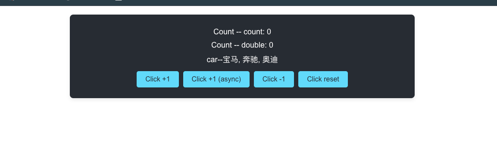

# mobx-react-lite + TypeScript 入门实战教程（完整版）
## 一、教程前言
MobX 是一款轻量级响应式状态管理库，相比 Redux 更简洁、学习成本更低；`mobx-react-lite` 是 MobX 专为 React 函数组件设计的轻量级绑定库，结合 TypeScript 可实现类型安全的状态管理。

本教程通过「计数器 + 汽车列表」实战案例，从零讲解 `mobx-react-lite` 核心用法，包含：可观察状态定义、动作/计算属性、全局状态共享、组件响应式渲染、异步状态处理等。

**示例仓库地址**：https://github.com/MyMessages/mobox-demo.git

---


## 二、环境准备与项目初始化
### 1. 克隆示例项目
```bash
# 克隆仓库到本地
git clone https://github.com/MyMessages/mobox-demo.git
# 进入项目目录
cd mobox-demo
```

### 2. 安装依赖
```bash
# 使用 npm 安装
npm install
# 或使用 yarn
yarn install
```

### 3. 核心依赖说明（package.json）
从截图可见，项目核心依赖如下：
```json
{
  "dependencies": {
    "mobx": "^6.15.0",          // MobX 核心库
    "mobx-react-lite": "^4.1.1",// React 函数组件绑定库
    "react": "^19.2.4",         // React 核心
    "react-dom": "^19.2.4",     // React DOM 渲染
    "typescript": "^4.9.5"      // TypeScript
  }
}
```

### 4. 启动项目
```bash
# 启动开发服务器
npm start
# 或 yarn
yarn start
```
启动后访问 `http://localhost:3000` 即可查看效果。

---

## 三、项目结构
```
mobox-demo/
└── src/
    ├── store/
    │   ├── counter.ts    # 计数器 Store（包含同步/异步操作、计算属性、副作用）
    │   └── car.ts         # 汽车列表 Store（可观察数组）
    ├── store.ts           # 根 Store & React Context 封装
    ├── App.tsx            # 主页面组件（observer 响应式组件）
    └── index.tsx          # 应用入口
```

---

## 四、核心代码实现

### 1. 计数器 Store（`src/store/counter.ts`）
```typescript
import { makeAutoObservable, autorun, reaction, runInAction } from 'mobx'

class Counter {
  constructor() {
    // 自动将类属性转为 observable，方法转为 action，getter 转为 computed
    makeAutoObservable(this, {}, { autoBind: true })
  }

  // 可观察状态：当前计数
  count = 0

  // 动作：同步 +1
  increment() {
    this.count++
  }

  // 动作：同步 -1
  decrement() {
    this.count--
  }

  // 动作：异步 +1（延迟 1 秒）
  incrementAsync() {
    setTimeout(() => {
      // 异步回调中修改状态必须用 runInAction 包裹，确保 MobX 追踪变更
      runInAction(() => {
        this.count++
      })
    }, 1000)
  }

  // 动作：重置计数
  reset() {
    this.count = 0
  }

  // 计算属性：count 的 2 倍（只读，缓存结果，依赖变化时才重新计算）
  get double() {
    return this.count * 2
  }
}

// 创建全局单例 Counter 实例
const counter = new Counter()

// 副作用：autorun —— 每次 count 变化自动执行
autorun(() => {
  console.log('[autorun] 当前 count:', counter.count)
})

// 副作用：reaction —— 精确监听 count 变化，可获取新值和旧值
reaction(
  () => counter.count,
  (newCount, oldCount) => {
    console.log(`[reaction] count 变化: ${oldCount} → ${newCount}`)
  }
)

export default counter
```

**关键知识点**：
- `makeAutoObservable`：MobX 6+ 推荐写法，自动完成状态/动作/计算属性的标记
- `autoBind: true`：自动绑定 `this` 指向，避免组件调用时丢失上下文
- `runInAction`：异步场景下修改状态的必备方法，确保变更被 MobX 捕获
- `autorun/reaction`：MobX 副作用 API，用于监听状态变化并执行日志/上报等逻辑

---

### 2. 汽车列表 Store（`src/store/car.ts`）
```typescript
import { makeAutoObservable } from "mobx"

class Car {
  constructor() {
    makeAutoObservable(this, {}, { autoBind: true })
  }

  // 可观察数组：汽车品牌列表
  list = ['Tesla', 'BMW', 'Audi']

  // 可选：新增修改数组的动作（示例）
  addCar(car: string) {
    this.list.push(car)
  }

  removeCar(index: number) {
    this.list.splice(index, 1)
  }
}

// 导出单例实例
export default new Car()
```

**关键知识点**：
- 数组/对象等引用类型会被 MobX 自动转为可观察结构
- 组件中使用 `car.list.join(', ')` 会自动监听数组变化，数组变更时组件自动重渲染

---

### 3. 根 Store & Context 封装（`src/store.ts`）
```typescript
import { createContext, useContext } from 'react'
import car from "./car"
import counter from './counter'

// 根 Store 类：组合所有子 Store，实现统一管理
class MobxStore {
  car = car
  counter = counter
}

// 创建全局单例根 Store
const store = new MobxStore()

// 创建 React Context，用于全局注入 Store
const storeContext = createContext(store)

// 自定义 Hook：简化组件中获取 Store 的方式，替代逐层传递 props
export const useStore = () => useContext(storeContext)
```

**关键知识点**：
- 使用 React Context 实现全局状态共享，任何组件都可通过 `useStore()` 获取根 Store
- 单例模式确保整个应用共享同一个状态实例

---

### 4. 主页面组件（`src/App.tsx`）
```tsx
import React from 'react'
import { observer } from 'mobx-react-lite' // 导入 observer 高阶组件
import { useStore } from './store'

// 使用 observer 包装组件，使其响应 MobX 状态变化
const App = observer(() => {
  // 从根 Store 中获取 counter 和 car 子 Store
  const { counter, car } = useStore()

  return (
    <div className="App">
      <header className="App-header">
        {/* 展示原始计数值 */}
        <p>Count -- old: {counter.count}</p>
        {/* 展示计算属性：计数值的 2 倍 */}
        <p>Count -- X2: {counter.double}</p>
        {/* 展示可观察数组 */}
        <p>Car List: {car.list.join(', ')}</p>

        {/* 同步 +1 按钮 */}
        <button onClick={counter.increment} style={{ margin: '0 5px' }}>
          Click +1
        </button>
        {/* 异步 +1 按钮（延迟 1 秒） */}
        <button onClick={counter.incrementAsync} style={{ margin: '0 5px' }}>
          Click +1 (async)
        </button>
        {/* 同步 -1 按钮 */}
        <button onClick={counter.decrement} style={{ margin: '0 5px' }}>
          Click -1
        </button>
        {/* 重置按钮 */}
        <button onClick={counter.reset} style={{ margin: '0 5px' }}>
          Click reset
        </button>

        {/* 可选：测试数组操作按钮 */}
        <button onClick={() => car.addCar('BYD')} style={{ margin: '0 5px' }}>
          Add BYD
        </button>
      </header>
    </div>
  )
})

export default App
```

**关键知识点**：
- `observer`：将 React 函数组件转为响应式组件，依赖的 MobX 状态变化时自动重渲染
- 组件中直接访问 `counter.count`、`counter.double`、`car.list`，无需额外监听逻辑
- 按钮点击直接调用 Store 中的 `action` 方法，遵循 MobX「**状态只能通过动作修改**」的规范

---

## 五、运行效果与交互说明
启动项目后访问 `http://localhost:3000`，可体验以下交互：
1. **基础计数操作**：
   - 点击 `Click +1`：计数立即 +1
   - 点击 `Click -1`：计数立即 -1
   - 点击 `Click reset`：计数重置为 0
   - 点击 `Click +1 (async)`：1 秒后计数 +1（异步场景演示）
2. **计算属性**：`Count -- X2` 会自动跟随 `count` 变化，始终显示 `count * 2`
3. **可观察数组**：点击 `Add BYD` 按钮，汽车列表会新增 `BYD`，页面自动更新
4. **控制台日志**：状态变化时，控制台会打印 `autorun` 和 `reaction` 的日志，直观展示状态变更监听效果

---

## 六、核心概念总结
| 概念 | 作用 | 代码示例 |
|------|------|----------|
| `observable` | 定义可观察状态 | `count = 0` / `list = ['Tesla', ...]` |
| `action` | 定义修改状态的方法 | `increment()` / `addCar()` |
| `computed` | 定义基于状态的衍生值（缓存结果） | `get double()` |
| `observer` | 让组件响应状态变化，自动重渲染 | `observer(() => { ... })` |
| `autorun` | 监听状态变化，自动执行副作用 | `autorun(() => console.log(counter.count))` |
| `reaction` | 精确监听某个状态，可获取新/旧值 | `reaction(() => counter.count, (new, old) => { ... })` |
| `runInAction` | 异步场景下修改状态，确保被 MobX 追踪 | `runInAction(() => this.count++)` |
| `useStore` | 自定义 Hook，全局获取根 Store | `const { counter } = useStore()` |

---

## 七、进阶优化与扩展
### 1. 性能优化：局部响应式渲染
如果组件大部分内容不依赖 MobX 状态，可使用 `Observer` 组件包裹局部内容，减少重渲染范围：
```tsx
import { Observer } from 'mobx-react-lite'

const OptimizedApp = () => {
  const { counter } = useStore()
  return (
    <div>
      <h2>固定标题（不会重渲染）</h2>
      {/* 仅这部分响应式更新 */}
      <Observer>
        {() => <p>Count: {counter.count}</p>}
      </Observer>
    </div>
  )
}
```

### 2. 多 Store 拆分
复杂项目可按业务模块拆分更多子 Store（如 `userStore`、`orderStore`），在根 Store 中组合：
```typescript
// src/store/user.ts
class UserStore { ... }
export default new UserStore()

// src/store.ts
class MobxStore {
  car = car
  counter = counter
  user = userStore // 新增用户 Store
}
```

### 3. 类型安全增强
TypeScript 会自动推断 Store 类型，也可显式定义接口：
```typescript
interface ICounter {
  count: number
  double: number
  increment: () => void
  decrement: () => void
  incrementAsync: () => void
  reset: () => void
}
```

---

## 八、部署与构建
### 1. 构建生产版本
```bash
npm run build
# 或 yarn
yarn build
```
构建产物会生成在 `build/` 目录，可直接部署到静态服务器。

### 2. 代码提交与推送
```bash
# 查看修改
git status
# 添加修改
git add .
# 提交
git commit -m "feat: complete mobx-react-lite demo"
# 推送到远程仓库
git push origin main
```

---

## 九、常见问题与避坑指南
1. **组件不响应状态变化**：
   - 确认组件是否被 `observer` 包裹
   - 确认状态修改是否在 `action` 或 `runInAction` 中执行
2. **异步状态不更新**：
   - 异步回调中修改状态必须用 `runInAction` 包裹
3. **this 指向丢失**：
   - 定义 Store 时添加 `{ autoBind: true }`，或在组件中手动绑定 `onClick={() => counter.increment()}`
4. **数组/对象不更新**：
   - 确保数组/对象是 MobX 可观察结构，避免直接赋值新数组/对象（推荐使用 `push`/`splice` 等方法）

---